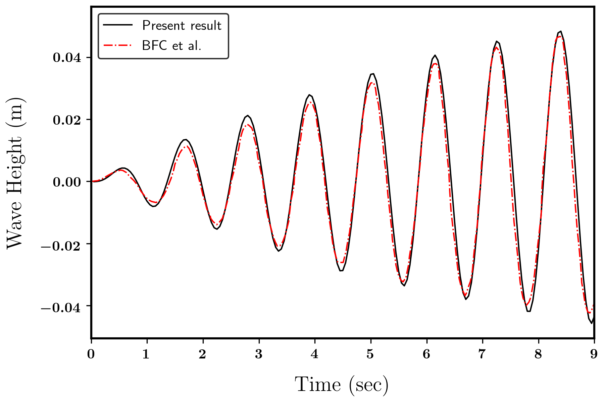

# Solve 2D liquid sloshing problem by Method of fundamental solution

## Introduction
**MFS_Sloshing** is a simple CFD project that solves 2D liquid sloshing problems of inviscid fluid. The code can be modifide easily by students interested in learning meshless method. More features will be added in the future.

***
## Brief theoretical description

Method of fundamental solutions (MFS), only need to distribute nodes on the physical boundaries and the virtual boundaries outside the computational domain. Comparing with the traditional mesh-based numerical method, this method has the advantage of being easy to construct and flexible in dealing with the moving boundary problem.

To establish a numerical model based on meshless method, the geometry of the problem is discretized by the method of fundamental solutions (MFS) in the domain and radial basis function collocation method (RBFCM) on free surface.

***
## Program Structure
Program structure of two meshless methods (RBFCM and MFS) are introduced in this section.

### RBFCM
* **GMMMQBasis2D.h** \
A class define the shape parameter when it is initialize. Compute the linear operation of the radial basis function and return it to **Collocation2D.h**.

* **Collocation2D.h** \
A fucntion collocate the nodes near the target node and return the local vector of this node cloud.
note: the first index indicate the target node.

### MFS
* **GMMMFSSloshing2D.h** \
The major part of the numerical model. Assembling the system matrix according to the governing equation and boundary conditions. Conducting the iteration process for Crank-Nicolson method for time marching.

### Others
* **GMMRectangular.h** \
A class generate a retangular domain with orthogonal node distribution. The nodes on the corner are neglected.

***
## Result
The wave elevation profile on left wall is shown in the figure.

***
## Dependencies
The following open source libraries or third party functions are used by this project:
- [Gmm++](http://getfem.org/gmm.html) library for matrix manipulation.
- [nanoflann](https://github.com/jlblancoc/nanoflann) is a C++ header-only library for building KD-Trees.
***
## References
[1] Chen, B.-F., & Chiang, H.-W. (1999). [Complete 2D and Fully Nonlinear Analysis of Ideal Fluid in Tanks](https://doi.org/10.1061/(asce)0733-9399(1999)125:1(70)). Journal of Engineering Mechanics, 125(1), 70–78.

[2] Tsai, C.-C., Lin, Z.-H., & Hsu, T.-W. (2015). [Using a local radial basis function collocation method to approximate radiation boundary conditions](https://doi.org/10.1016/j.oceaneng.2015.06.030). Ocean Engineering, 105, 231–241. 

[3] Chen, W., Zhuo. & Chen, C. (2014). Recent advances on radial basis function collocation methods. Berlin: Springer.